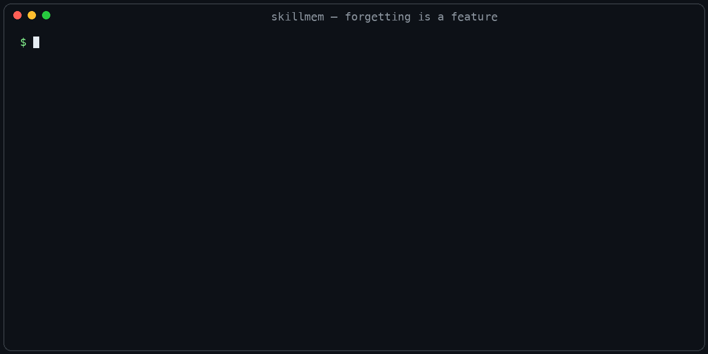

# skillmem

<!-- mcp-name: io.github.liza-studio/skillmem -->

[](https://github.com/liza-studio/skillmem/actions/workflows/ci.yml)

**Self-improving skills for Claude Code and Codex — your agents learn, recall, reinforce, and forget.**



skillmem gives Claude Code and the Codex CLI a local, persistent skill & memory layer. After every non-trivial task the agent can record *how it was done* as a skill; before the next task it recalls the relevant ones; skills that keep proving useful get stronger, and skills nobody uses fade away — the way human memory works.

- **$0 per write and per read** — no LLM calls, no cloud, no API keys. Plain SQLite on your disk.
- **Bilingual hybrid search, fully local** — FTS5 BM25 + Snowball stemming (EN/RU) + a multilingual ONNX embedding model. A Russian query finds an English skill and vice versa, all on CPU, offline.
- **Ebbinghaus strength model, earned not claimed** — strength rises only on evidence from outside the agent's own judgement, falls after a failure, and fades on a schedule when unused; dead skills are swept to a backed-up archive (never deleted). Rules that are rare by nature can be pinned out of decay.
- **Tamper-evident history** — every edit is appended to a SHA256 hash-chain; `skillmem verify` detects any after-the-fact tampering.
- **Deep Claude Code integration** — 6 hooks + 9 MCP tools installed with one command.
- **One memory, several agents** — Claude Code and Codex share a single database, and every
  record carries the agent that wrote it, taken from the MCP handshake, so authorship stays
  readable when they learn side by side.
- **Cross-platform** — macOS (launchd), Windows (schtasks), Linux (systemd user timers, cron fallback).
- **No vendor lock** — `export-all` dumps everything to plain markdown with YAML frontmatter; re-importing the dump yields the same records.

## Why

Agents repeat their mistakes because each session starts from zero. Existing "memory" tools store facts; skillmem stores *procedures* — trigger, steps, outcome, lessons — and ranks them by how often they actually helped. The write path costs nothing, so the agent can afford to learn from every task.

## Quickstart

macOS / Linux:

```bash
bash install.sh                 # installs python + uv if needed, venv, symlinks
```

Windows (PowerShell):

```powershell
powershell -ExecutionPolicy Bypass -File install.ps1
```

Or from a checkout:

```bash
uv venv && uv pip install -e '.[semantic]'
source .venv/bin/activate       # or prefix the commands below with `uv run`
skillmem init --claude-code     # wires MCP server + hooks into Claude Code
skillmem init --codex           # wires the MCP server into the Codex CLI
skillmem init --all-agents      # ...or all six at once (see below)
skillmem doctor                 # health check: DB, schema, semantic status
```

Flags combine in one run — the agents then share one database.

### All six agents

| Flag | Agent | Config it writes |
|---|---|---|
| `--claude-code` | Claude Code | `~/.claude.json` + hooks in `~/.claude/settings.json` |
| `--codex` | Codex CLI | `~/.codex/config.toml` |
| `--cursor` | Cursor | `~/.cursor/mcp.json` |
| `--windsurf` | Windsurf | `~/.codeium/windsurf/mcp_config.json` |
| `--gemini` | Gemini CLI | `~/.gemini/settings.json` |
| `--opencode` | opencode | `~/.config/opencode/opencode.json` |

Every entry is idempotent and backed up before it is touched; a config that
does not parse is left alone rather than overwritten. Each agent is stamped
with `SKILLMEM_AGENT`, so in a shared database "who learned this" stays
answerable. `skillmem uninstall` removes all of them (`--no-editors` to keep
the editor entries).

`init --claude-code` registers the MCP server in `~/.claude.json` and the hooks in `~/.claude/settings.json` (idempotent, with backups). Use `--hooks minimal` for just the Stop→migrate hook, or `--hooks none` for MCP only.

### Codex CLI

```bash
skillmem init --codex
```

Appends an `[mcp_servers.skillmem]` table to `~/.codex/config.toml` and marks the entry with
`SKILLMEM_AGENT=codex`. The tag is belt-and-braces: with no tag set, the server takes the
author's name from the agent's own MCP handshake, so attribution is right in a shared
database whichever way skillmem was installed.
The file is appended to, never rewritten: your own settings and comments stay where you put
them, the result is parsed before it is written, and invalid TOML is refused rather than
overwritten. `skillmem uninstall` removes the table again and leaves the rest of the file intact.

Codex reads `AGENTS.md` for project rules; if you keep yours in `CLAUDE.md`, point Codex at it
with `project_doc_fallback_filenames = ["CLAUDE.md"]` in the same config file — then both agents
follow one set of rules and one memory.

### As a plugin

The repo is also a plugin, in two flavours, both pointing at the same `skillmem-mcp` binary:

- **Agent Plugins** (`plugin.json` + `mcp.json` at the repo root) — what the Codex CLI installs from a
  marketplace. `mcp.json` needs both its `$schema` and `"type": "stdio"`, and the command must be a bare
  executable name rather than an absolute path — Codex's parser ignores the file otherwise, with no error.
  `codex mcp list` listing the server is the check that it parsed.
- **Claude Code** (`.claude-plugin/` + `hooks/hooks.json`) — MCP server *and* all six hooks in one install.

Either way the package itself must be on PATH (`pip install skillmem`); the plugin wires the server, not the runtime. An MCP Registry manifest (`server.json`) is in the repo as well:

```
/plugin marketplace add liza-studio/skillmem
/plugin install skillmem@liza-studio
```

The plugin requires the skillmem Python package on PATH and replaces `skillmem init --claude-code`'s wiring — use one or the other, not both (see [docs/PUBLISHING.md](docs/PUBLISHING.md)).

### Claude Desktop (chat app)

The MCP server also works in the Claude Desktop chat app — add to
`claude_desktop_config.json` (Settings → Developer → Edit Config):

```json
{
  "mcpServers": {
    "skillmem": { "command": "skillmem-mcp" }
  }
}
```

You get all 9 `mem_*` tools on demand (search, learn, recall, reinforce…).
The automatic hooks (auto-recall on every prompt, session recap) are a
Claude Code mechanism and do not run in the chat app.

## How it works

```
 learn ──▶ recall ──▶ reinforce ──▶ decay
   │          │            │           │
   │          │            │           └─ daily job: unused skills lose strength;
   │          │            │              fully faded ones are archived (backed up)
   │          │            └─ strength +0.15 on outside evidence; ×0.7 after a failure
   │          └─ hybrid BM25 + vector search, strength-weighted ranking
   └─ after a hard task: trigger / steps / outcome / lessons
```

1. **learn** — after a task that took real debugging, the agent calls `mem_learn` with a slug, trigger, steps, outcome, and lessons.
2. **recall** — before the next task, `mem_recall` (or the automatic hooks) surfaces the most relevant skills, fusing lexical and semantic signals via Reciprocal Rank Fusion.
3. **reinforce** — when a recalled skill is confirmed by something outside the agent's own judgement (a test that passed, a diff that was accepted, the user saying so), `mem_reinforce` raises its strength, so proven skills rank higher next time. The agent calling its own skill useful is recorded but not rewarded; a task that failed after applying a skill lowers it. Rules that matter precisely because they are rarely needed can be exempted from decay with `mem_pin`.
4. **decay** — a scheduled `skillmem decay` run applies Ebbinghaus-style forgetting; skills untouched for months drift to `stale`, then to an `archived` state (excluded from recall, restorable with one command, snapshotted to JSONL first).

## MCP tools

| Tool | What it does |
| --- | --- |
| `mem_search` | Hybrid full-text search (FTS5 BM25 + optional vector recall) over all memories |
| `mem_get` | Fetch one memory by slug, with history and wikilinks |
| `mem_list` | List memories by kind/project, most recent first |
| `mem_write` | Insert a new memory; refuses silent overwrites and near-duplicates |
| `mem_update` | Update an existing memory; old version is kept in the hash-chained history |
| `mem_learn` | Record an after-action skill (trigger / steps / outcome / lessons) |
| `mem_recall` | Find relevant skills for a task, strength-weighted; refreshes recency |
| `mem_reinforce` | Record how a skill turned out; only outside evidence moves strength |
| `mem_pin` | Exempt a skill from decay and archiving (and undo it) |

## Hooks

| Event | Hook | What it injects |
| --- | --- | --- |
| SessionStart | `mcp-guard` | Warns when configured MCP servers are missing vs a baseline |
| SessionStart | `inject` | Compact title-only briefing of your `user`/`feedback` memories |
| SessionStart | `session-history` | Recaps of the last 3 sessions in this project |
| UserPromptSubmit | `verify-gate` | "Search before you claim" reminder on time-sensitive prompts (bilingual EN/RU triggers) |
| UserPromptSubmit | `auto-recall` | Relevant feedback + skills matched against the prompt |
| PreToolUse | `tool-recall` | Skills/warnings matched against the Bash command or edited file path |
| Stop | `session-recap` | Distills the session into a markdown note via `claude -p` (recap language mirrors the session) |
| Stop | `migrate` | Indexes new session notes into the database |

All hooks are best-effort: a broken database or missing model never blocks Claude Code.

## CLI highlights

```bash
skillmem learn skill-x -t "..." --trigger "..." --steps "..." --outcome success
skillmem recall "deploy the bot to prod"
skillmem skills                  # list skills with strength bars
skillmem decay --days 14         # manual decay + lifecycle sweep
skillmem search "hash chain" --kind feedback
skillmem verify --strict         # check the tamper-evidence chain
skillmem export-all ./vault      # markdown round-trip, no lock-in
skillmem import-vault ~/Obsidian/Notes
skillmem schedule install        # decay daily 04:15, export weekly Sun 04:30
```

## Uninstall

```bash
skillmem uninstall               # removes MCP entries (both agents), hooks, scheduled jobs; keeps the DB
skillmem uninstall --purge-db    # ...and deletes the database
```

Config edits are made atomically with timestamped backups; corrupt JSON or TOML is never overwritten.

## Benchmarks

Retrieval quality on [LongMemEval](https://github.com/xiaowu0162/LongMemEval) (Wu et al., ICLR 2025), full oracle set, **hybrid retrieval** (FTS5 BM25 + Snowball stemming + `paraphrase-multilingual-MiniLM-L12-v2` embeddings, RRF fusion), k=5, CPU only:

| Question type | n | hit@5 | MRR |
|---|---|---|---|
| **Overall** | **479** | **0.871** | **0.622** |
| single-session-assistant | 56 | 0.982 | 0.746 |
| knowledge-update | 72 | 0.944 | 0.676 |
| single-session-user | 64 | 0.938 | 0.719 |
| multi-session | 125 | 0.848 | 0.568 |
| single-session-preference | 30 | 0.833 | 0.465 |
| temporal-reasoning | 132 | 0.780 | 0.579 |

Median 0.76 s per query on a laptop CPU, no LLM calls, no network. The pipeline is deterministic: repeated runs produce identical numbers. Reproduce with `python bench/longmemeval.py --sample 0 -k 5` (see [bench/README.md](bench/README.md) for the oracle file and reporting rules — we don't publish bare percentages without stating the retrieval mode and embedding model, and we encourage other tools to do the same).

## License

Apache-2.0 — see [LICENSE](LICENSE).

---

Built by **Liza Studio**.
